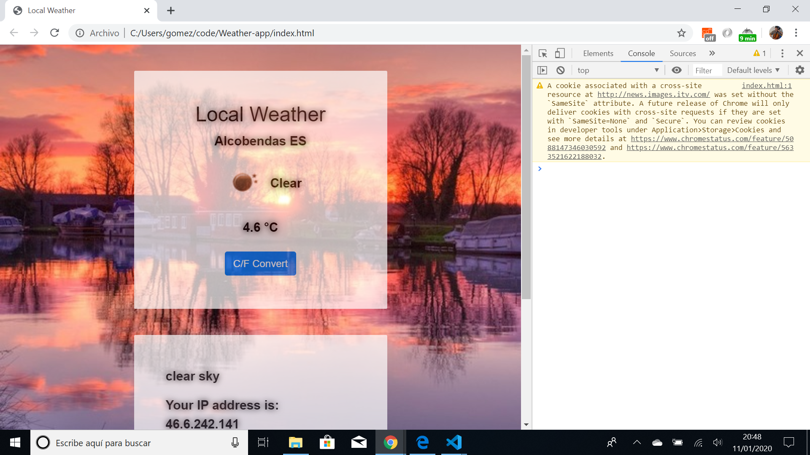

# :zap: Javascript/jQuery Weather App

* Free Code Camp Assignment: [Take Home Projects - Show the Local Weather](https://www.freecodecamp.org/learn/coding-interview-prep/take-home-projects/show-the-local-weather). This was part of the old FCC curriculum but has been moved to a 'take-home-prroject' but I see the User Stories (Software Requirements) are still the same.
* **Note:** to open web links in a new window use: _ctrl+click on link_


## :page_facing_up: Table of contents

* [General info](#general-info)
* [Screenshots](#screenshots)
* [Technologies](#technologies)
* [Setup](#setup)
* [Features](#features)
* [Status](#status)
* [Inspiration](#inspiration)
* [Contact](#contact)

## :books: General info

* Uses an API to bring in weather data and display it.

## :camera: Screenshots

.

## :signal_strength: Technologies

* Ran in Google Chrome browser with: [Javascript engine V8 7.9.317.32 for Windows (x64)](https://v8.dev/).

## :floppy_disk: Setup

* Open index.html in browser. If any code is changed the browser needs to be refreshed.

## :computer: Code Examples

* Function to convert Farenheit temperature values to Celcius.

```javascript
$("#convert").click(function(){
      if (tempSwap===false){
        $("#temperatureC").html(tempF + " °F");
        tempSwap=true;
      } 
      else {
        $("#temperatureC").html(tempC + " °C");
        tempSwap=false;
      }
    })/*end of convert function*/
```

## :cool: Features

*  Background image changes according to temperature, as per specification.

## :clipboard: Status & To-Do List

* Status: Working.
* To-Do: Switched location to Japan sometimes if not Alcobendas Spain - find out wtf. Code could be optimised - e.g. using latest ES6 ternery expressions etc.

## :clap: Inspiration

* Free Code Camp Assignment: [Take Home Projects - Show the Local Weather](https://www.freecodecamp.org/learn/coding-interview-prep/take-home-projects/show-the-local-weather).
* [Using Preload and Prefetch in Your HTML to Load Assets](https://alligator.io/html/preload-prefetch/)

## :file_folder: License

* This project is licensed under the terms of the MIT license.

## :envelope: Contact

* Repo created by [ABateman](https://github.com/AndrewJBateman), email: gomezbateman@yahoo.com
